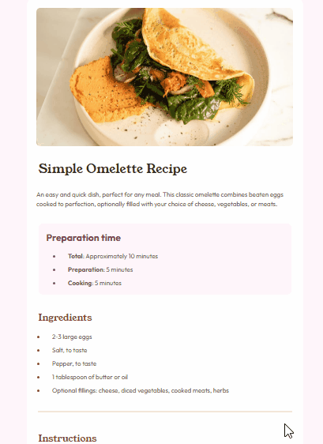

# Segundo Desafio FrontEnd Mentor Recipe-page-main
Realizado durante estudos HTML5 e CSS3 intermediário curso DevQuest.🚀
## Tecnologias utlizadas
- HTML5
- CSS3
## Objetivos
- Praticar.
- Responsividade.
- Centralizar elementos.
## Prévia da aplicação
[]

